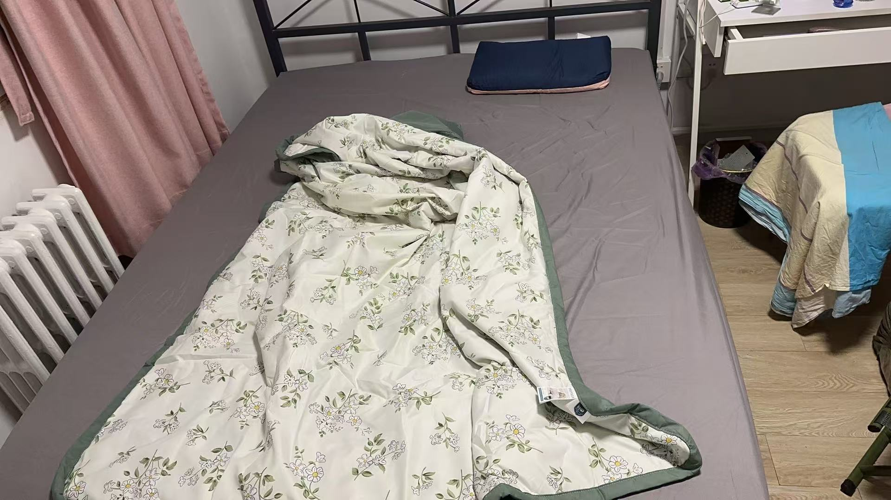
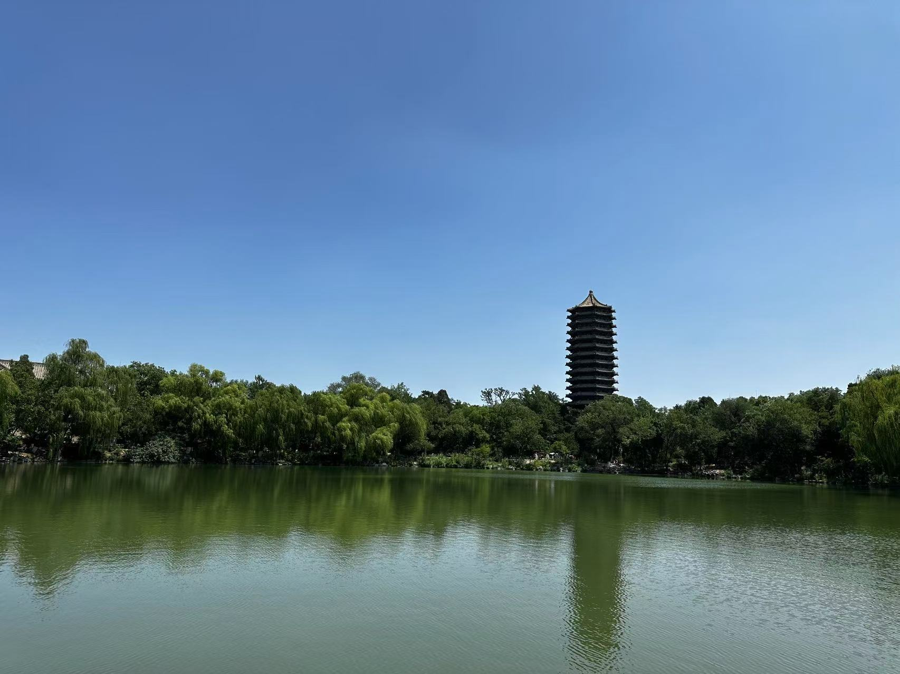
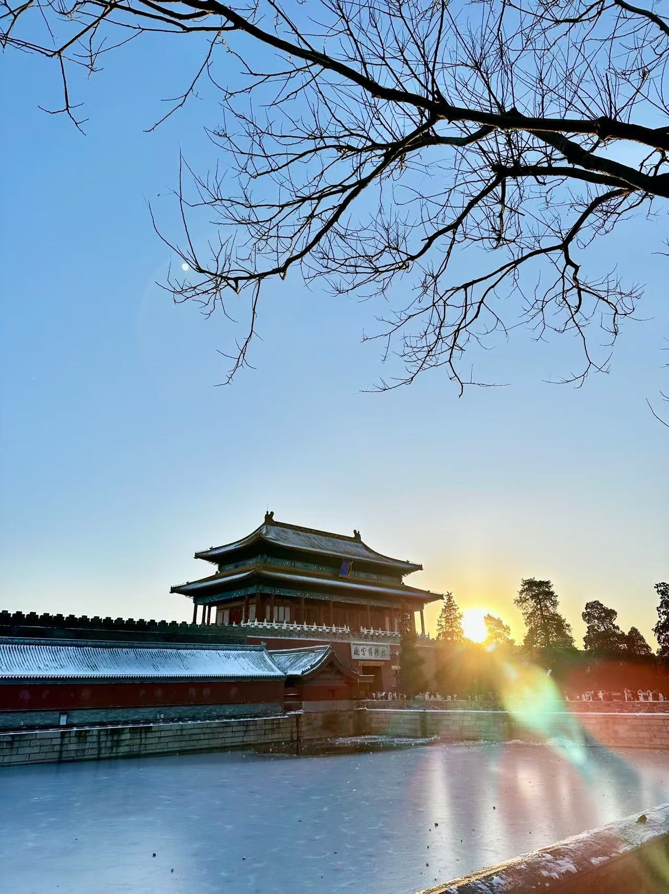
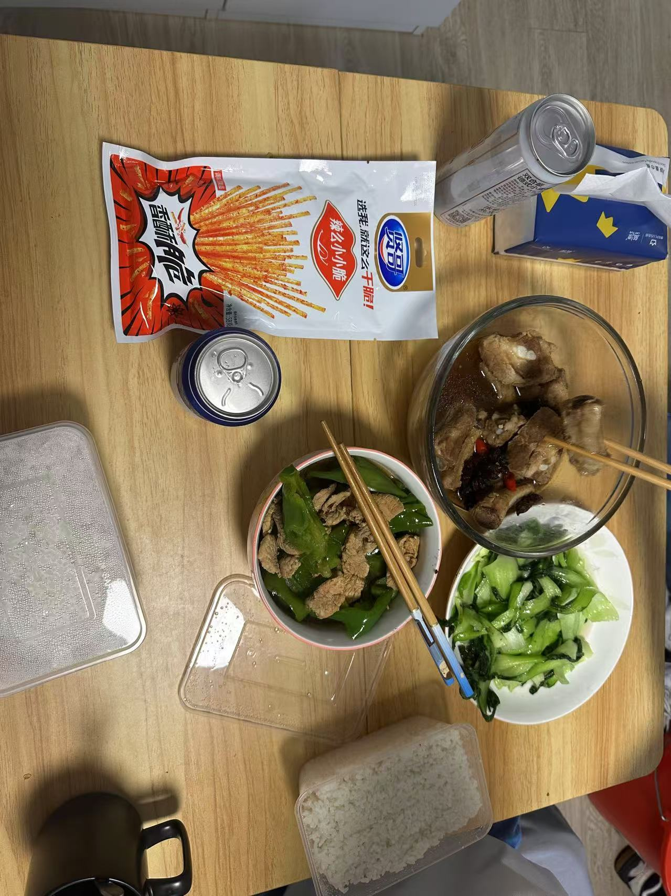
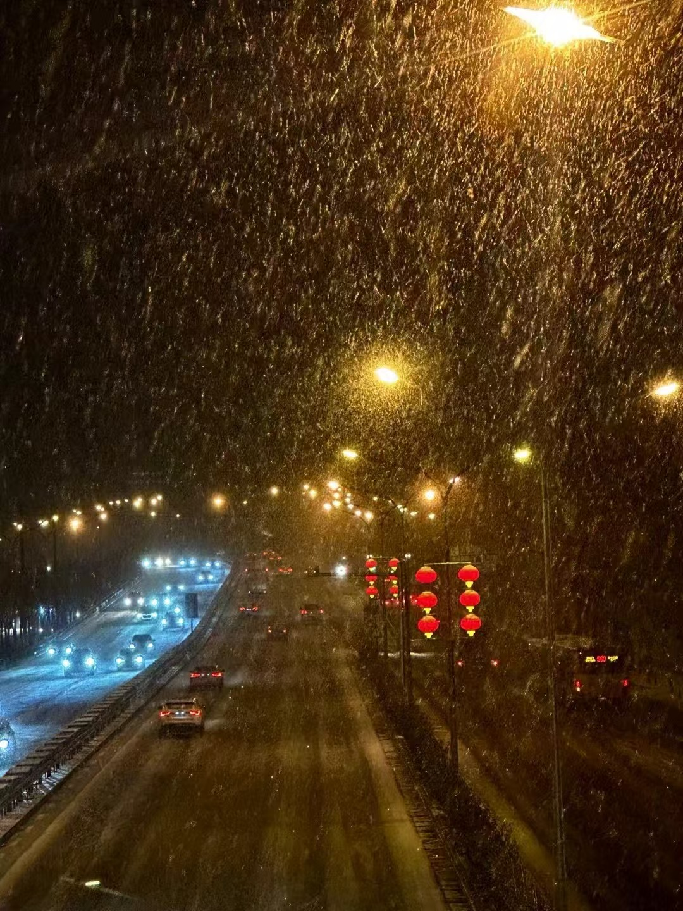
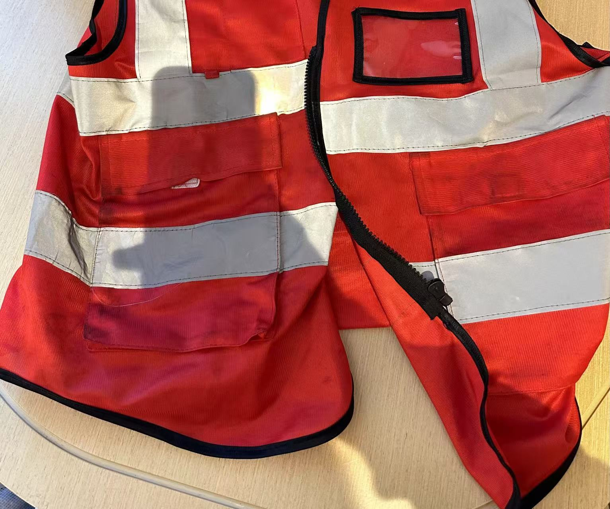
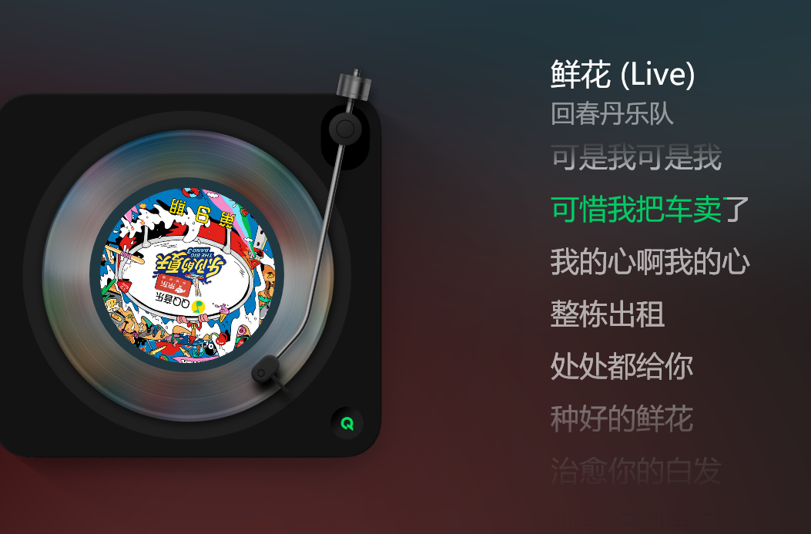
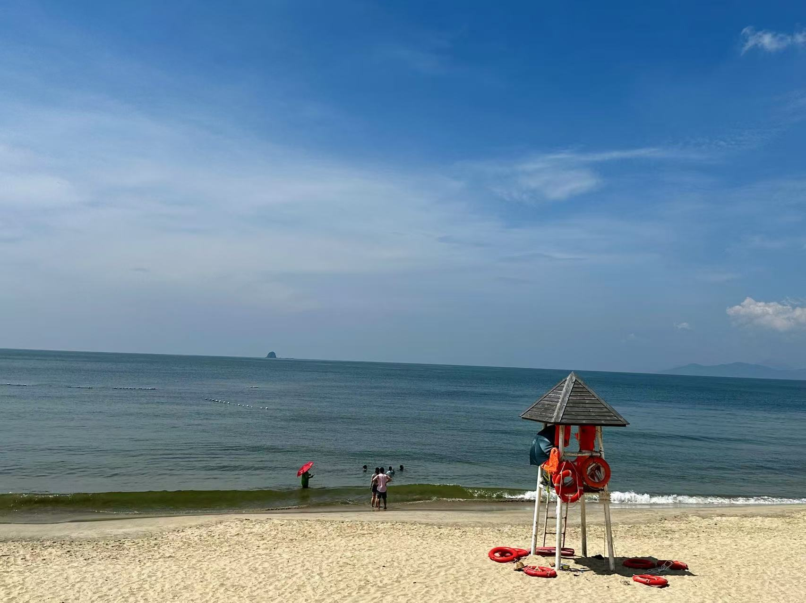

某个平淡的午后，突然得知比我大两岁的朋友准备生娃了，震惊之余，回想过去一年的种种离奇遭遇，瞬间感觉自己老了，尽管我才98年，所以就开始提笔写这篇文章了。

---

因为恰巧赶上了疫情后的经济寒潮，碰上史上最难一届秋招，我手上就零星几个offer，没有选择的权利，所以被迫去了最不想去的北京，进入了自动驾驶行业。

确定了工作去处后，我对未来十分憧憬，小学-初中-高中-大学-硕士，整整19年寒窗苦读，我终于逃离了“牢笼”，心想着终于可以过上自食其力的幸福生活了，但没想到**第一年就遭遇了社会的当头一棒**。

### 起

去京城前，心想着我这“乡下人”终于可以见识见识大城市了，真是满怀期待。去北京那天，我独自坐了一路高铁，第一次看到了北京的晚霞，心里的期待又多了一分。打车到出租屋时已是深夜，当我拖着行李箱顺着漆黑和狭窄的巷子拐进所住的小区时，我才第一次见识到传说中的“老破小”：楼梯过道坑坑洼洼的墙壁，积满灰与堆着各式杂物的楼梯，发黄且略显灰暗的声控灯，当然还有我那小得可怜但又贵得出奇的“小窝”。在北京的第一夜，孤独、失落、对未知的恐惧等各种感觉让我五味杂陈，心里空落落的。

北京出租屋

尽管在北京生活的中后期发生了太多太多事，让我一度对生活失去信心，但不得不说，前期我真的过得挺幸福的，甚至幸福得有点不真实。

首先是在北京要好的同学很多，一来就受到了硕士同学的款待，吃了顿北京涮羊肉火锅。接着又跟着本科同学去参观了传说中的北大，在未名湖旁吹了吹风，和同学忆往昔峥嵘岁月的同时，赞叹着北大食堂的豪华以及校园环境的优美。

北大未名湖

然后是玩乐。北京作为首都，有着深厚的文化底蕴，所以好玩的地方也非常多，我经历了人生很多第一次：去看了人生第一次话剧；去秦皇岛看了刘谦精彩绝伦的魔术演出；去北戴河人生第一次看海，并且看的是绝美且治愈的海上日出；去国家网球中心第一次现场看网球比赛，还看到了堪比大满贯决赛的梅总与辛纳之争；去滑了雪；去看了雪中故宫；去朝阳公园玩了浆板；去了颐和园；去了西湖；去了灵隐寺。。。还有很多很多美好回忆，现在想来也很幸福。

雪中故宫

除了到处玩，从来不会做菜的我竟然喜欢上了做菜。从一开始的煎个蛋都能煎黑的菜鸡，到后来开始煎豆腐、炒白菜、蒜香鸡翅、辣子鸡、玉米炖排骨、炒豆泡等等，一开始自己都下不了嘴，后来慢慢觉得自己做得挺好吃，这让我每个周末都过得异常充实。做饭最大的幸福在于可以做自己喜欢吃的菜，一顿不够可以两顿。

和朋友一起做饭

### 承

当身边朋友都在苦逼的加班以至于没有生活时，我就常常感觉这快乐的生活有些许不真实，莫名担心它哪一天会结束，没想到有一天真的迎来了转折点。还是后来下定决心跳槽时，我试图回想什么时候落入这牢笼的时候，才发现那一天真的是一切痛苦的开始。

我的工作职位是传说中的自动驾驶感知算法工程师，主要负责BEV障碍物检测算法，请注意这个“主要”，看完后面的叙述你会知道它真是“主要”，必须加上这个修饰。

那一天正值海淀初雪，雪对南方人天生有种魔力，我带着初雪的喜悦去了公司，被告知调去新项目帮忙，担任的职责有个高大上的学名：后融合，简单来说就是融合多个模态（lidar、radar、纯视觉）模型的预测结果。一开始听说要用C++且做的东西是我从未做过的，我很兴奋，因为又能学到新东西，接受新的挑战了。带着这份兴奋，我短时间入门了C++，同时借着ChatGPT，我终于能帮着写些简单的函数了。

下班天桥上的雪景

慢慢的，一些脏活累活开始找上我了。首先就是出差去某主机厂基地驻场，主要工作就是上车看看我们的算法效果。这是我人生第一次出差，大致流程就是跟着测试人员找各种场景测试，记录badcase，这还是我第一次上车，惊喜地发现我们的算法效果还不错。不过这次整体体验很差，一是因为流程混乱，按理说会有专门的测试人员协助我们，结果发现从拉取软件包、到编译程序、再到启动录制全都得自己来，什么文档也没有；二是因为车子出了故障，莫名在红绿灯路口误触发SOS，拔了电池重启都没用，喝了半小时刺骨且夹着冷雨的西北风后只能无赖回酒店了。

很长一段时间里，我都天真地以为派我们出差真的是为了看路测效果，后来出差多了，**发现出差的真正目的只有一个，主机厂想面对面地监视我们干活。大致就是以前的奴隶主监督着黑人摘棉花那种感觉，唯一区别是有没有鞭子，或者说鞭子是物理的还是其他形式的**。

用奴隶主形容此主机厂是一点都不过分。尤其是在如今的自动驾驶市场下，主机厂牢牢握住供应商的命脉：供应商没有车，算法只有上车才能卖钱。因此主机厂是绝对的甲方，供应商则是卑微的乙方，乙方必须卑躬屈膝，舔着脸求主子给个量产单子，哪怕是PoC(Proof of Concept，概念验证，证明你的算法是否行得通)也好，不管要求多严格、多无理，都照单全收，什么**白盒交付、主动驻场、陪同加班**都不在话下。供应商卑微地把钱搞到了，勉强生存下去，而底下的研发工程师们则累得哭爹喊娘，并且将大部分生命都浪费在讨好主机厂且与技术无关的无意义琐事上，这也是我最后离开自驾这一行的主要原因。

印象里最深的一次是做后融合的人全部被派去驻场了，也是那次驻场直接导致了我最后的离职。那一次和以往有很大不同，以往并不会严格要求你作息，你早走晚走实际上并没有太大的影响，但那一次甲方明文要求**早八晚十，一周七天**，公司某领导还在群里说是对我们的恩赐，关键是组长也来了，所以不好“旷工”。驻场的办公室就在总装车间上方，每一天都要和同事穿着和环卫工人所穿相差无几的红色马甲，闻着机油味和灰尘味路过这车间，看着严格遵守路线的寻迹小车发会呆，然后左转，总有个主播在那直播卖车，接着是爬满是高中才有的奋斗标语的楼梯，右转，走过一道长廊，每次走时都会往左侧窗外看看辛勤工作的工人们，也不知道为什么要看，最后到了，印入眼帘的是一排排没有隔板的白色桌子，桌子上是电脑、公司自己运过来的显示器（是的你没有看错，我们自己运来的）、插满插头的插线板、随意丢弃的饮料或是零食垃圾以及目光呆滞、穿着“环卫工”衣裳的牛马们。oh，对了，最深处一排可不是牛马，是某主机厂的老爷们，来监工的！

红色马甲

**去办公室的路本不长，可每次走的时候我都觉得好长好长，每一天都比昨天对工作和生活感到更失望，仿佛路上有吸人精血的恶鬼，每次到工位时便全无干劲可言**。有人可能会好奇，你不是算法工程师吗，不就训训模型、处理数据就没事干了吗，天天早八晚十哪有那么多事做？你不说我都快忘了我是算法工程师了，因为我真的找不到那时在做的事和“算法工程师”有任何关联，我做的事随便拉个本科生都能做，根本用不着我这个百无一用的“高材生”。每天的工作只有两件，一是分析JIRA上路测反馈的Badcase，没做过后融合的人可能不知道这个分析过程有多恶心，后融合概括来说无非就是不断地写If else来给上游感知算法兜底，因此所谓分析其实就是找是哪个If else逻辑的锅，而且代码是C++的，一些难的case你要手动print调试一层一层找，当然最让人绝望的其实还是无法If else保证互相之间不打架，又称跷跷板，所以Badcase 是无穷无尽的；二是将上下游分析完成的Badcase汇成ppt，注意是格式有严格要求的一页PPT，阐述清楚问题现象、原因、修复方案及日期，我们私下里戏称为“**奏折**”，毕竟花这么大力气做这么一个花哨的东西的目的只有一个，让“皇上”能看懂并且相信我们确实解决了某个case。而项目经理每天的活就是“批阅奏折”，对自己人严加要求，动辄打回，然后给“主子”汇报今日解决多少badcase，还剩多少。

就这样撑到了第五天，我们解决了大量的badcase，甚至让主机厂的人感叹还是驻场效率高，这也直接导致了后来越来越频繁的出差，当然这是后话。“劳作”了五天，牛马都想休息了，每个人心中的怨气也积累得快要爆炸，于是组长想给我们放一天假，但上面规定是七天无休，所以只能抽签轮休。抽签的方式是微信跳一跳，也许是确实过得太压抑了，一个这么简单的游戏我们竟然玩得津津有味，最终我们平常玩得最好的四个人抽到了周六休息。第二天，我们迫不及待地开车去市里透透气，淋着小雨绕着某景点走了很久，一路上有说有笑、吐槽着公司和主机厂的xx，骂骂这个，骂骂那个，一会聊到过去，一会畅想未来，倒是颇有些“**携来百侣曾游，忆往昔峥嵘岁月稠。恰同学少年...**”的意境。好不容易被放出来，大家都不太想回去，直到晚上十点我们才赶回酒店，回去的时候还给刚下班的战友们待了肯德基还是麦当劳。周日，组长突然提议大家晚上去K歌，释放下情绪，现在看来这是个极好的提议，毕竟音乐的本质就是情感，唱歌就是情感的表达，那晚，我们四人小队或许是真的太苦闷了，鬼哭狼嚎到了凌晨两点多，凌晨三点才回到酒店。那晚让我印象最深的歌是《鲜花》，里面的歌词真是太能表达我当时的感受了，“**你那快乐吗？我期待的吗？**”，“**还记得笑吗？**”，“**可是我可惜我，把车卖了**”，以及最后的“**啊...**”，后来我多次唱过这首歌，却怎么也唱不出当时的感觉。

《鲜花》歌词

值得庆幸的是，公司决定后面派人来轮流驻场，因此我们又待了一周就陆续回去了，要是真待上一个月，怕是我们组当场就得解散。当然，可笑的是，后来听说因为某些原因，我们那两周解的“成吨”的badcase几乎都作废了，所以现实有时候就是个笑话。当然其间其实还发生了很多可笑又可恨的事，某公司的“恶心”行径实在是“罄竹难书”。

比如之前是某著名公司全球副总裁的某CEO，在一个平凡的周末在公司群里说周一有要事宣布，要求大家明天早上8:00到公司，虽然平时上班时间是10:00多，不去也不违反公司的任何规定，但是还是有很多人准时去了，也许这就是老牛马的服从性吧。来不及为它们感到悲哀，就听闻传说中的要事是这周开始大家要早八晚十，直到项目攻关结束。因为我们不打卡，这位CEO为了保证我们“准时”上下班，**不仅暗中命令门卫记录我们每个人上下班的时间，而且还去每个人工位拍照，记录谁谁“旷工”**，这件事让我深刻见识到了什么是中国公司的管理手段，什么是全球副总裁。

再比如某CTO在某会上被主机厂的领导辱骂之后（小道消息），开始上演离职大戏，这场戏前前后后持续了几个月，某天他又说突然不走了，说要成立某某部门，不再碰和主机厂相关的事，于是把我身边的人一一拆散，接着又真的离职了，留下这没人接的烂摊子。

再比如公司去年拖到今年的年终奖，说是只有做量产的人才有，最可笑的是，如果你跟着上面那位CTO转去某部门，不管之前你对项目贡献多大、熬了多少夜，你的年终奖都要被再拖三个月，甚至身边有反抗的同事被穿小鞋，干着最脏最累的活，年终奖系数却被降到几乎没有的地步。

### 转

那次早八晚十出差后，已是四月份，我已经有了离职的念头。公司被这一个量产搞得极其动荡，尤其是某CTO说要跑路的时候，身边的同事纷纷想离职，每天八卦的是谁谁刷了多少题，谁谁已经面了多少公司，谁谁要last day了。**那时只要一进公司，仿佛踏入一滩死水，被“死亡”的气息压得喘不过气，看谁都像行尸走肉，有时候甚至像牛头或马头人身的真牛马，对人生充满了绝望**。

当确认自己不能再承受更多失望以及想换个环境后，某天我请了一天假，认真思考到底要不要离职，主要思考了两点，一是担心我只有差不多一年经验，出去有没有人要我，能不能找到工作；二是深入想了想这公司还有没有什么我值得留恋的地方，我在手机上敲了很多字，罗列我留恋的东西，发现唯一舍不得的只有组里待我很好很好的同事们。抉择的当天晚上，我下了离职的决心，对于第一点，一年经验有没有公司要没人能说得定，不试试怎么知道，试了既能让我不再颓废，又能真正了解自己一年以来的进步；对于第二点，大厦将倾，身边人都是要离职的阵仗，而且我们小组已被某CTO拆散，所以即使我不离开，也留不住他们。

于是乎我开始了痛苦而漫长的刷题之旅。校招时，由于内部和外部的极端压力（内要毕业，外是寒冬），我并没有太多时间刷题，算上去实验室路上强行背的题，总共刷的题甚至没有超过150题，也因此错过一些本来就难得的面试机会。这次借着离职的决心，决定补齐刷题这个短板，刷题语言也由Python变成了新学的C++。从四月份下旬到七月，我由一开始的全凭心情的每周零散刷几题模式，**慢慢变成每日至少一题，时间是早晨和晚上下班，凭着“做题家”的毅力和多年来培养的“做题”能力，我把《代码随想录》完整刷了一遍，再加上leetcode上的hot100以及常考的面试题，最后刷了将近300道题吧**，“代码能力”（背题能力！）以肉眼可见的速度在提升。

补齐了这个大短板，我几乎再无短板，写简历、面试“吹牛”都是我所擅长的。写简历我大概只用了两天，由于**在BEV障碍物检测、单目3D障碍物检测、后融合、车道线等各个模块都打过杂**，我能写的东西非常多，也因此从未因为一年经验被嫌弃过，在那之前还从未想到自己厌恶的事情（到处打杂）最终却使我受益最多。另外，最让我感动的是，**相比于那寒冬得不能再寒冬的校招，人生第一次社招的面试机会异常多，几乎只要投了就有面试机会，看来早生或晚生一年也许真能逆天改命**。虽然面试机会非常多，但我还在职，所以那段时间显得异常忙碌，有时早上和晚上都有面试，白天还要上班，整个人疲惫不堪。但幸运的是面试过程都异常顺利，大都按我简历上引导的方向去提问，代码题也是几乎都做出来了，印象最深的一件事是，几乎每个面试官都会怀着好奇或是同情的心情问我为什么才一年就跳槽了，我给他们吐槽了在公司的种种离谱遭遇后，他们都非常理解我的选择，甚至有的和我一起骂该公司。

### 合

由于实在不想在这乌烟瘴气之地久留，我把面试时间都排得尽可能的紧凑，从面试到拿到大部分offer的过程只持续了不到3周。纠结了一段时间手上的offer后，我最终决定离开了自动驾驶行业，感性地选择了大多数人不会选的一个offer。这是一个非常冒险的决定，以前那个谨小慎微、多方权衡的我是绝不会做出这个选择的，但我实在厌倦了墨守陈规的生活，索性“离经叛道”了一把。

选好下一站后，我的离职速度是同事始料未及的，**从提交离职申请和交接、到请散伙饭、到离开北京、到新城市租好房、再到新公司入职，不过一周多一点而已**。没办法，我实在对一年来发生的一切太失望了，也对租房、物价过高的北京没有了任何好感，没有一丁点想留下来的欲望，北京户口我也早早地放弃了。在北京的最后一周，为了尽可能不留遗憾，我去逛了一些没逛过的景点，去鸟巢看了邓紫棋的演唱会，也是人生第一次看演唱会，和在北京的朋友一一吃饭和道别，小电驴卖给了师弟（这会是真的卖车了哈哈），房子租给了好朋友。这一周我过得无比放松，上一次这么放松还是刚来北京的时候，另外，也许是无论哪座城市，只要以打工人的角度去看都会心生厌恶，这次我以旅游的角度观察北京时，反倒觉得北京确实是个不错的城市，那么多景点、那么多好玩的去处，只可惜一点，不适合穷人。

邓紫棋演唱会

现在的我已经回到了南方，在新城市、新公司生活和工作了几个月，各方面来说都比较满意，比如说租房方面，我以比北京三人合租更低的价格租到了30多平的公寓，有沙发，每天下班回家还能躺着看看电视或者打打游戏。再比如说工作方面，再也没有量产压力，没有驻场，没有那么多无聊会议，可以“心安理得”地双休，甚至第二周就碰上了团建。

团建

再比如我终于又能有时间写文章，此时此刻，窗外下着大雨，电脑里放着略显悲伤的音乐，正在电脑前码字的我，再回头看看一年来的动荡岁月，真是有点“**眼看它起高楼，眼看它楼塌了**”的感觉，就像《红楼梦》里的大观园一般，一开始大家都在，热热闹闹的，大家也很有干劲，然后大leader走了，再然后隔壁组的小组长也走了，再然后同组的同事也走了，最后甚至隔壁组所有人都走光了，同组的也仅剩因为客观原因走不了的几个人，都是多么优秀的人啊，却还是免不了“群芳流散”的命运。

---

正如你所看到的，对于一个初入社会的人来说，这是多么糟糕的一年，我失望过、彷徨过，但我从来没有绝望过，正如我的座右铭“雄关漫道真如铁，而今迈步从头越”，人要向前看，向前走，不怕任何妖魔鬼怪，不怕任何失败，大不了从头再来！

---
写文章这么多年，还没有建过交流群，今天就索性建一个，就叫“无名氏的工作学习生活交流群”，主打一个“包罗万象”，大家有什么想咨询我的可以在群里问我，欢迎大家加入~

